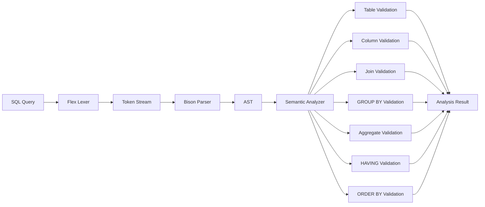

<div align="center">

# ⚡ SQL Parser, AST & Semantic Analyzer

### A Compiler-Style SQL Front End Built with C++17, Flex & Bison

<br>


<br><br>

[](https://github.com/RoyalTejShinde1993/SQL_Parser_AST_Analyzer_Cpp17_ANTLR4_Bison)
[](https://isocpp.org/)
[](https://www.gnu.org/software/bison/)
[](https://cmake.org/)
[](#-testing)

</div>

---

## 📑 Contents

* [Overview](#-overview)
* [Why This Project](#-why-this-project)
* [Architecture](#-architecture)
* [Processing Pipeline](#-processing-pipeline)
* [Supported SQL](#-supported-sql)
* [AST Design](#-ast-design)
* [Semantic Analysis](#-semantic-analysis)
* [Operator Precedence](#-operator-precedence)
* [Project Structure](#-project-structure)
* [Build & Installation](#-build--installation)
* [Usage](#-usage)
* [Examples](#-examples)
* [Testing](#-testing)
* [Design Decisions](#-design-decisions)
* [Current Scope](#-current-scope)
* [Future Enhancements](#-future-enhancements)
* [Learning Outcomes](#-learning-outcomes)
* [Author](#-author)

---

# 🎯 Overview

**SQL Parser, AST & Semantic Analyzer** is a compiler-style SQL processing system implemented in **C++17** using **Flex/Lex** and **Bison**.

The project takes a SQL statement and processes it through a structured front-end pipeline:

```text
SQL Source
    │
    ▼
┌──────────────────────┐
│   Lexical Analysis   │
│      Flex / Lex      │
└──────────┬───────────┘
           │ Tokens
           ▼
┌──────────────────────┐
│       Parsing        │
│        Bison         │
└──────────┬───────────┘
           │
           ▼
┌──────────────────────┐
│         AST          │
│ Abstract Syntax Tree │
└──────────┬───────────┘
           │
           ▼
┌──────────────────────┐
│  Semantic Analysis   │
│                      │
│ Tables • Columns     │
│ Joins • Grouping     │
│ Aggregates • HAVING  │
│ ORDER BY             │
└──────────┬───────────┘
           │
           ▼
     Analysis Result
```

The implementation intentionally separates **syntax recognition** from **semantic validation**, following the architecture of a traditional compiler front end.

---

# 💡 Why This Project?

A SQL query can be syntactically valid while still being semantically invalid.

For example:

```sql
SELECT unknown_column
FROM users;
```

A parser can recognize the structure of this query successfully.

However, the semantic analyzer must determine whether `unknown_column` exists in the available schema.

This project therefore demonstrates the distinction:

```text
┌───────────────────────┐
│   Syntax Analysis     │
│                       │
│ "Is the SQL grammar   │
│  valid?"               │
└───────────┬───────────┘
            │
            ▼
┌───────────────────────┐
│  Semantic Analysis    │
│                       │
│ "Does the query make  │
│  semantic sense?"     │
└───────────────────────┘
```

---

# 🏗️ Architecture



---

# 🔄 Processing Pipeline

The complete processing flow is:

```text
             ┌──────────────┐
             │  SQL String  │
             └──────┬───────┘
                    │
                    ▼
             ┌──────────────┐
             │    Lexer     │
             │    Flex      │
             └──────┬───────┘
                    │
                 Tokens
                    │
                    ▼
             ┌──────────────┐
             │    Parser    │
             │    Bison     │
             └──────┬───────┘
                    │
                    ▼
             ┌──────────────┐
             │     AST      │
             │ C++ Objects  │
             └──────┬───────┘
                    │
                    ▼
          ┌─────────────────────┐
          │ Semantic Analyzer   │
          ├─────────────────────┤
          │ • Tables            │
          │ • Columns           │
          │ • Joins             │
          │ • Grouping          │
          │ • Aggregates        │
          │ • HAVING            │
          │ • ORDER BY          │
          └──────────┬──────────┘
                     │
                     ▼
             ┌──────────────┐
             │   Result     │
             │ Valid/Invalid│
             └──────────────┘
```

---

# 🚀 Supported SQL Features

## Query Structure

| Feature            | Status |
| ------------------ | :----: |
| `SELECT`           |   🟢   |
| `DISTINCT`         |   🟢   |
| Column aliases     |   🟢   |
| Table aliases      |   🟢   |
| Qualified columns  |   🟢   |
| `*` wildcard       |   🟢   |
| `table.*` wildcard |   🟢   |

---

## 🔍 Filtering & Expressions

| Feature                | Status |
| ---------------------- | :----: |
| `WHERE`                |   🟢   |
| `AND`                  |   🟢   |
| `OR`                   |   🟢   |
| `NOT`                  |   🟢   |
| `=`                    |   🟢   |
| `<>`                   |   🟢   |
| `<`                    |   🟢   |
| `>`                    |   🟢   |
| `<=`                   |   🟢   |
| `>=`                   |   🟢   |
| Arithmetic expressions |   🟢   |
| `IS NULL`              |   🟢   |
| `IS NOT NULL`          |   🟢   |
| `IN`                   |   🟢   |
| `NOT IN`               |   🟢   |

---

## 🔗 JOINs

| JOIN         | Status |
| ------------ | :----: |
| `INNER JOIN` |   🟢   |
| `LEFT JOIN`  |   🟢   |
| `RIGHT JOIN` |   🟢   |
| `FULL JOIN`  |   🟢   |
| `CROSS JOIN` |   🟢   |

---

## 📊 Aggregation

| Feature    | Status |
| ---------- | :----: |
| `GROUP BY` |   🟢   |
| `HAVING`   |   🟢   |
| `COUNT()`  |   🟢   |
| `SUM()`    |   🟢   |
| `AVG()`    |   🟢   |
| `MIN()`    |   🟢   |
| `MAX()`    |   🟢   |

---

## ↕️ Ordering

| Feature           | Status |
| ----------------- | :----: |
| `ORDER BY`        |   🟢   |
| `ASC`             |   🟢   |
| `DESC`            |   🟢   |
| ORDER BY alias    |   🟢   |
| ORDER BY position |   🟢   |

---

# 🌳 AST Design

The parser converts SQL syntax into an **Abstract Syntax Tree**.

For:

```sql
SELECT name
FROM users
WHERE id = 10;
```

the AST is conceptually:

```text
SelectStatement
│
├── SelectItem
│   │
│   └── ColumnRef
│       └── name
│
├── From
│   │
│   └── TableRef
│       └── users
│
└── Where
    │
    └── BinaryExpr: =
        │
        ├── ColumnRef
        │   └── id
        │
        └── Literal
            └── 10
```

---

## 🧩 Expression Hierarchy

The implementation contains dedicated AST representations for different expression categories.

```text
Expr
│
├── ColumnRef
│
├── Literal
│
├── BinaryExpr
│
├── ArithmeticExpr
│
├── UnaryExpr
│
├── FunctionCall
│
├── NullCheckExpr
│
└── InExpr
```

This structure allows expressions to be analyzed recursively.

---

# 🧠 Semantic Analysis

The semantic analyzer operates on the AST after successful parsing.

Its responsibilities include:

### 🗂️ Table Validation

Checks whether referenced tables are available in the analyzer schema.

### 🧱 Column Validation

Checks whether referenced columns exist.

### 🔗 Join Validation

Validates table and column references used by join conditions.

### 📊 GROUP BY Validation

Checks that non-aggregate selected expressions follow the implemented grouping rules.

### 🧮 Aggregate Validation

Detects aggregate functions:

```text
COUNT
SUM
AVG
MIN
MAX
```

and recursively analyzes their expressions.

### 🧪 HAVING Validation

Checks grouped and aggregate expressions used in `HAVING`.

### ↕️ ORDER BY Validation

Validates:

* regular expressions
* qualified columns
* SELECT aliases
* positional expressions
* grouping-related expressions

---

# 🧠 Boolean Expression Precedence

Boolean precedence is explicitly defined in the Bison grammar.

The logical relationship is:

```text
             NOT
              │
              ▼
        Comparisons
              │
              ▼
             AND
              │
              ▼
              OR
```

Therefore:

```sql
WHERE id = 1
  AND name = 'Alice'
  OR email = 'x';
```

is represented as:

```text
                 OR
                /  \
              AND   =
             /  \   / \
            =    = ...
```

while:

```sql
WHERE id = 1
  AND (name = 'Alice' OR email = 'x');
```

becomes:

```text
                 AND
                /   \
               =     OR
                    /  \
                   =    =
```

This is an important parser-level correctness property.

---

# 🚫 NOT as a Unary AST Node

The parser represents `NOT` using a dedicated unary expression.

For:

```sql
WHERE NOT id = 1;
```

the AST is conceptually:

```text
UnaryExpr: NOT
│
└── BinaryExpr: =
    ├── ColumnRef: id
    └── Literal: 1
```

For:

```sql
WHERE NOT (id = 1 OR id = 2);
```

the AST becomes:

```text
UnaryExpr: NOT
│
└── BinaryExpr: OR
    ├── BinaryExpr: =
    │   ├── ColumnRef: id
    │   └── Literal: 1
    │
    └── BinaryExpr: =
        ├── ColumnRef: id
        └── Literal: 2
```

---

# 🔗 JOIN Representation

JOIN types are explicitly represented in the AST.

```cpp
enum class JoinType {
    INNER,
    LEFT,
    RIGHT,
    FULL,
    CROSS
};
```

Example:

```sql
SELECT users.name
FROM users
LEFT JOIN orders
    ON users.id = orders.user_id;
```

is represented conceptually as:

```text
SelectStatement
│
├── From
│   └── users
│
└── JoinClause
    ├── Type: LEFT
    ├── Table: orders
    │
    └── Condition
        └── BinaryExpr: =
            ├── users.id
            └── orders.user_id
```

---

# 📁 Project Structure

```text
SQL_Parser_AST_Analyzer_Cpp17_ANTLR4_Bison/
│
├── 📂 grammar/
│   ├── sql_lexer.l
│   └── sql_parser.y
│
├── 📂 include/
│   ├── ast.hpp
│   └── semantic_analyzer.hpp
│
├── 📂 src/
│   ├── ast.cpp
│   ├── main.cpp
│   └── semantic_analyzer.cpp
│
├── 📂 tests/
│   └── run_tests.sh
│
├── ⚙️ CMakeLists.txt
│
├── 📄 sql_parser.tab.c
├── 📄 sql_parser.tab.h
└── 📖 README.md
```

---

# 🧰 Technology Stack

<div align="center">

|   Technology   | Role                |
| :------------: | :------------------ |
|    **C++17**   | Core implementation |
| **Flex / Lex** | Lexical analysis    |
|    **Bison**   | Grammar & parsing   |
|    **CMake**   | Build system        |
|    **Bash**    | Regression testing  |
|     **Git**    | Version control     |
|   **GitHub**   | Repository hosting  |

</div>

---

# ⚙️ Build & Installation

## Prerequisites

Install:

* C++17-compatible compiler
* CMake
* Flex
* Bison
* Bash
* Git

---

## Clone

```bash
git clone https://github.com/RoyalTejShinde1993/SQL_Parser_AST_Analyzer_Cpp17_ANTLR4_Bison.git

cd SQL_Parser_AST_Analyzer_Cpp17_ANTLR4_Bison
```

---

## Configure

```bash
mkdir -p build
cd build

cmake ..
```

---

## Build

```bash
cmake --build . -j2
```

The executable is generated as:

```text
build/sql_analyzer
```

Return to the repository root:

```bash
cd ..
```

---

# ▶️ Usage

Run the analyzer:

```bash
./build/sql_analyzer "SELECT name FROM users;"
```

The program displays:

```text
SQL: SELECT name FROM users;

Parser pipeline:
  SQL -> Lexer -> Bison Parser -> AST -> Semantic Analysis

Syntax: valid
Semantic analysis: valid
```

---

# 🧪 Examples

## Example 1 — Basic SELECT

```bash
./build/sql_analyzer \
"SELECT name FROM users;"
```

---

## Example 2 — Filtering

```bash
./build/sql_analyzer \
"SELECT name FROM users WHERE id > 10;"
```

---

## Example 3 — Boolean Expressions

```bash
./build/sql_analyzer \
"SELECT name FROM users WHERE id = 1 AND name = 'Alice' OR email = 'x';"
```

---

## Example 4 — JOIN

```bash
./build/sql_analyzer \
"SELECT users.name FROM users LEFT JOIN orders ON users.id = orders.user_id;"
```

---

## Example 5 — GROUP BY

```bash
./build/sql_analyzer \
"SELECT department, COUNT(id) FROM employees GROUP BY department;"
```

---

## Example 6 — HAVING + ORDER BY

```bash
./build/sql_analyzer \
"SELECT department, COUNT(id) FROM employees GROUP BY department HAVING COUNT(id) > 5 ORDER BY department;"
```

---

# 🧪 Testing

The project contains an automated regression test suite.

Run:

```bash
./tests/run_tests.sh
```

### Current Result

<div align="center">


</div>

```text
Passed: 71
Failed: 0
Total:  71
```

The regression suite covers both **positive syntax/semantic cases** and **negative validation cases**.

---

# 🔬 Verification

The final implementation was verified using:

```bash
cmake --build . -j2
```

followed by:

```bash
./tests/run_tests.sh
```

Result:

```text
Passed: 71
Failed: 0
Total:  71
```

Repository whitespace validation:

```bash
git diff --check
```

Final repository state:

```text
Working tree: clean
Branch: main
Remote: origin/main
```

---

# 🏛️ Design Decisions

## 1. Parser and Semantic Analyzer Are Separate

The parser is responsible for syntax and AST construction.

The semantic analyzer is responsible for meaning and validation.

```text
Parser
  │
  ▼
AST
  │
  ▼
Semantic Analyzer
```

This prevents grammar logic from becoming tightly coupled with semantic validation.

---

## 2. AST Instead of Direct String Validation

Rather than validating raw SQL strings, the analyzer works with structured C++ objects.

This enables recursive processing of complex expressions.

---

## 3. Recursive Expression Analysis

Expressions such as:

```sql
NOT (id = 1 OR id = 2)
```

form a tree:

```text
NOT
└── OR
    ├── =
    └── =
```

The analyzer can therefore recursively inspect every component.

---

## 4. Explicit JOIN Types

JOIN types are represented using an enumeration instead of treating all JOINs as generic operations.

This provides a clean foundation for additional join-specific semantic rules.

---

## 5. Automated Regression Testing

Every new grammar or semantic feature should be backed by regression tests.

This reduces the risk of breaking previously supported SQL constructs.

---

# 📊 Current Scope

### Implemented

```text
SELECT
DISTINCT
Aliases
Qualified columns
Wildcards
WHERE
AND / OR / NOT
Comparison operators
Arithmetic expressions
IS NULL / IS NOT NULL
IN / NOT IN
INNER JOIN
LEFT JOIN
RIGHT JOIN
FULL JOIN
CROSS JOIN
GROUP BY
HAVING
COUNT
SUM
AVG
MIN
MAX
ORDER BY
ORDER BY aliases
ORDER BY positions
Semantic validation
Automated regression testing
```

---

# 🚧 Current Limitations

This project currently focuses on a SELECT-oriented subset of SQL.

The following are **not currently implemented**:

* `INSERT`
* `UPDATE`
* `DELETE`
* `CREATE TABLE`
* `ALTER TABLE`
* `DROP TABLE`
* Subqueries
* CTEs
* `UNION`
* `INTERSECT`
* `EXCEPT`
* Window functions
* `CASE`
* `BETWEEN`
* `LIKE`
* `LIMIT`
* `OFFSET`

These are potential future extensions.

---

# 🔮 Future Roadmap

```text
                    Current
                       │
                       ▼
             ┌─────────────────┐
             │ SELECT SQL Core │
             └────────┬────────┘
                      │
       ┌──────────────┼──────────────┐
       ▼              ▼              ▼
   Subqueries       CTEs        Set Operations
       │              │              │
       ▼              ▼              ▼
     UNION        WITH ...      UNION / EXCEPT
       │
       └──────────────┬──────────────┘
                      ▼
              Advanced SQL Layer
                      │
          ┌───────────┼───────────┐
          ▼           ▼           ▼
       Window       CASE       LIMIT/OFFSET
      Functions    Expressions
```

Potential future areas include:

* richer type checking
* symbol/scope resolution
* subqueries
* CTEs
* set operations
* DML
* DDL
* window functions
* additional SQL expressions
* query transformation
* query optimization

---

# 🎓 Learning Outcomes

This project provides practical experience with:

### Compiler Construction

* lexical analysis
* grammar design
* parser generation
* operator precedence
* AST construction
* semantic analysis

### C++

* C++17
* smart pointers
* polymorphic AST nodes
* recursive data structures
* `dynamic_cast`
* object ownership

### Software Engineering

* modular architecture
* automated regression testing
* CMake
* Git
* GitHub
* incremental feature development
* regression-safe changes

---

# 🏆 Project Highlights

<div align="center">

|         Metric         |      Result     |
| :--------------------: | :-------------: |
|       🧠 Language      |    **C++17**    |
|        🔤 Lexer        |  **Flex / Lex** |
|        🧩 Parser       |    **Bison**    |
|         🌳 AST         | **Implemented** |
|  🔍 Semantic Analysis  | **Implemented** |
|      🔗 JOIN Types     |      **5**      |
| 📊 Aggregate Functions |      **5**      |
|   🧪 Regression Tests  |      **71**     |
|        ✅ Passing       |      **71**     |
|        ❌ Failed        |      **0**      |

</div>

---

# 📌 Example: Complete Query

A representative supported query:

```sql
SELECT
    u.name,
    COUNT(o.id)
FROM users u
LEFT JOIN orders o
    ON u.id = o.user_id
WHERE u.id > 10
GROUP BY u.name
HAVING COUNT(o.id) > 2
ORDER BY u.name DESC;
```

Processing:

```text
SQL
 │
 ├── Lexer
 │     └── Tokens
 │
 ├── Bison Parser
 │     └── Grammar validation
 │
 ├── AST
 │     ├── SelectItem
 │     ├── TableRef
 │     ├── JoinClause
 │     ├── BinaryExpr
 │     ├── FunctionCall
 │     └── OrderBy
 │
 └── Semantic Analyzer
       ├── Table validation
       ├── Column validation
       ├── Join validation
       ├── GROUP BY validation
       ├── Aggregate validation
       ├── HAVING validation
       └── ORDER BY validation
```

---

# 🧭 Repository

<div align="center">

### 🔗 Source Code

[](https://github.com/RoyalTejShinde1993/SQL_Parser_AST_Analyzer_Cpp17_ANTLR4_Bison)

**Repository**

`RoyalTejShinde1993/SQL_Parser_AST_Analyzer_Cpp17_ANTLR4_Bison`

</div>

---

# 👨‍💻 Author

<div align="center">

### RoyalTejShinde1993

C++ • Compiler Construction • Parsing • AST • Semantic Analysis

[](https://github.com/RoyalTejShinde1993)

</div>

---

# ⭐ Final Summary

> **A C++17 compiler-style SQL front end that transforms SQL source code through lexical analysis, Bison parsing, AST construction, and semantic validation.**

The project demonstrates how a structured language can be processed from raw source text into a validated intermediate representation using traditional compiler-design techniques.

---

<div align="center">

### ⚡ Built with C++17 • Flex • Bison • CMake

**71 / 71 Regression Tests Passing**

</div>
